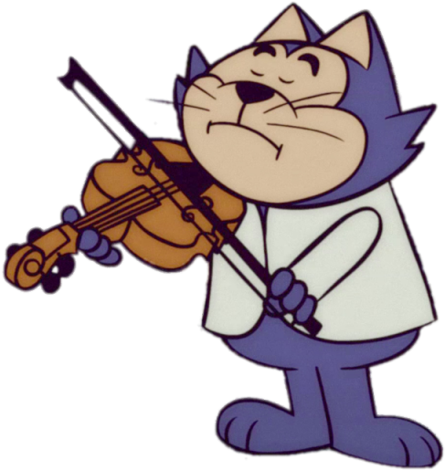
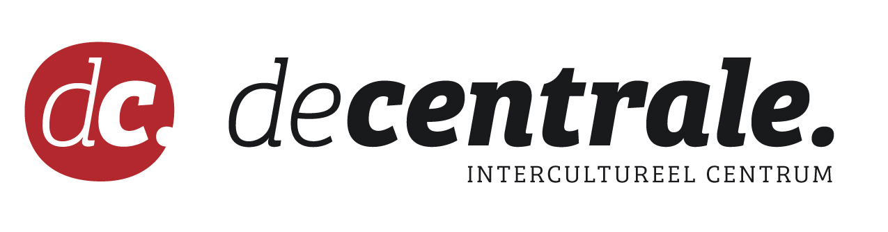

 

Vanaf november 2021 wordt aan de Centrale (intercultureel centrum) gratis vioolles gegeven! 

Deze lessen worden georganiseerd in het kader van een wetenschappelijke studie. Deelname aan het onderzoek is een voorwaarde om de wekelijkse vioollessen gratis te kunnen volgen bij de Centrale.

Op deze website vind je alle noodzakelijke informatie.
Wens je nog meer info, dan kan je mailen via de contact-pagina.

Inschrijven? Klik **[HIER](https://decentrale.be/viool)**

