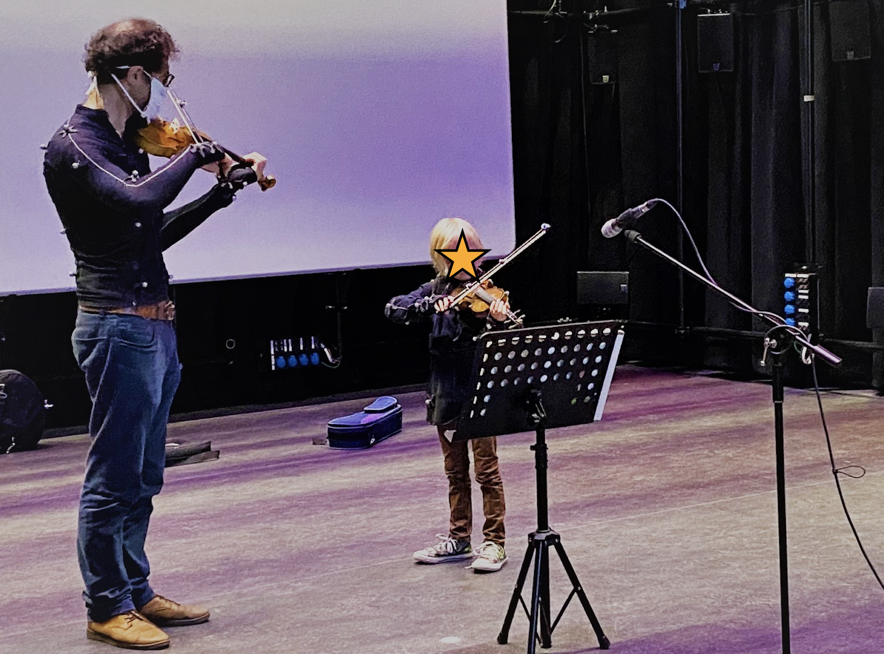

 

 

In het kader van het EU-project CONBOTS doet de UGent (Afdeling 
musicologie - IPEM) onderzoek naar het motorische leervermogen van 
beginnende  violisten  en  drummers,  dit  met  het  oog  op  de 
ontwikkeling van nieuwe technologie die op termijn leren op afstand 
mogelijk maakt. Het onderzoek staat onder leiding van Aleksandra 
Michalko, dr. Adriaan Campo, dr. Edith Van Dyck en prof. dr. Marc 
Leman.

Omdat de wekelijkse lessen kaderen in een wetenschappelijke studie,
zullen er **4 lessen in ons labo in de Krook plaatsvinden.**

**Hoe vaak?**

1 les per 2 maanden gedurende het schooljaar. De 4 lessen in de Krook duren ongeveer 45 minuten. Voor de exacte datums spreken we nog met jou, je ouders en je leerkracht af. 

Polar Express images 2004 by Warner Bros. Ent.I

**Wat gebeurt er tijdens een les in ons lab?**

Je volgt een gewone vioolles waarvoor je in ons lab een speciaal pak aantrekt dat het mogelijk  maakt  om  de  bewegingen  van  het  lichaam  te  registreren 
(hetzelfde pak wordt trouwens ook gebruikt tijdens het aanmaken 
van  computerspelletjes  en  animatie-  en  actiefilms). Achteraf worden de bewegingen geanalyseerd om zo de motorische en muzikale vooruitgang gedurende het schooljaar te meten.

Alle materialen en toestellen die gebruikt worden tijdens de sessies zijn niet invasief en veilig voor kinderen en volwassenen. Bovendien is de studie goedgekeurd door de Ethische Commissie van de UGent.

**Wat wordt er verwacht van ouders?** 

Zorgen dat het kind op tijd naar de sessies komt en wekelijks een korte vragenlijst invullen over de oefentijd van uw kind. Ook zal er gevraagd worden om eenmalig een vragenlijst over muzikale achtergrond in te vullen.

**Continuïteit**

De voorziene duurtijd is vanaf november 2021 tot en met juni 2022.

**Aan/Afwezigheid**

Deelname aan het onderzoek is een voorwaarde om de wekelijkse vioollessen gratis te kunnen volgen bij de Centrale. Het is dus erg belangrijk dat leerlingen **OP ALLE 4 LESSEN IN DE KROOK AANWEZIG** zijn. 

Je mag natuurlijk je deelname aan het project op ieder moment stopzetten.

**Welke data gaan we verzamelen en hoe worden ze verwerkt?** 

Tijdens de les worden er video, audio en motion capture opnames 
gemaakt. We gaan ook de hartslag van uw kind meten tijdens het spelen. Alle  resultaten  worden  verwerkt  met  respect  voor  de 
geldende privacywetten en met dekking van de Ethische Commissie. Beelden worden op geen enkele wijze online verspreid, 
of op andere manieren gedeeld. 

**Extra info**

Voor elke sessie in ons lab wordt ook **een drankbon voor het Krookcafé voor de ouders** voorzien.
 
**Onderzoek en corona**

De  hele  studie  gebeurt  met  inachtneming  van  de  geldende 
coronamaatregelen. 

 

