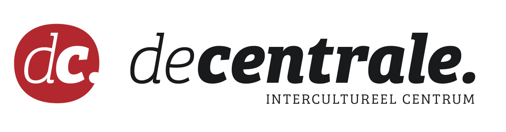

 

 

De wekelijkse lessen vinden plaats in de Centrale:

De Centrale | intercultureel centrum

Kraankindersstraat 2 - 9000 Gent

https://decentrale.be

Inkom Concertzalen
Ham 72 (glazen deur)

1 keer om 2 maanden kom je voor 1 les bij IPEM, in De Krook:

Miriam Makebaplein 1, 

9000 Ghent 

https://dekrook.be/

 

**Aan/Afwezigheid**

Deelname aan het onderzoek is een voorwaarde om de wekelijkse vioollessen gratis te kunnen volgen bij de Centrale. Het is dus erg belangrijk dat leerlingen **OP ALLE 4 LESSEN IN DE KROOK AANWEZIG** zijn.

**Continuïteit**

De voorziene duurtijd is vanaf november 2021 tot en met juni 2022.

Inschrijven? Klik **[HIER](https://decentrale.be/viool)**
